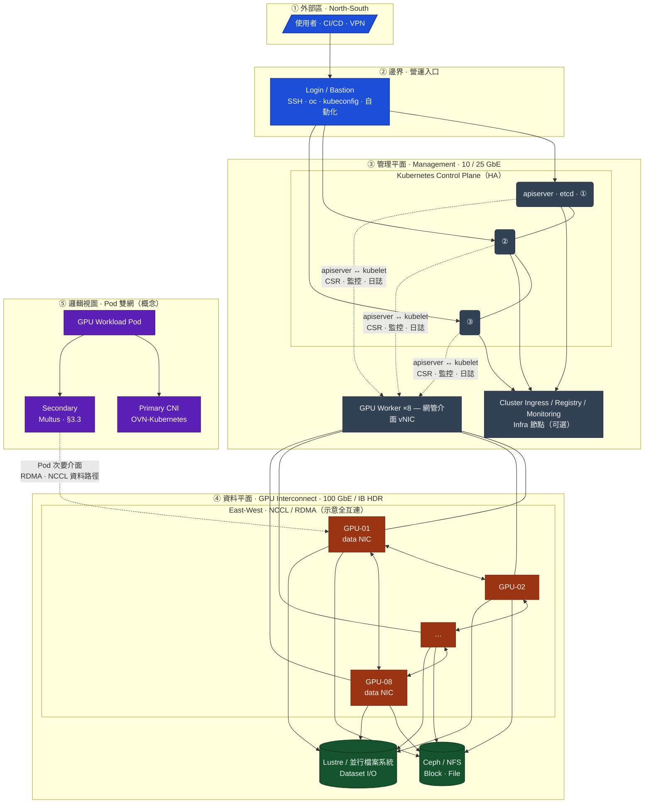
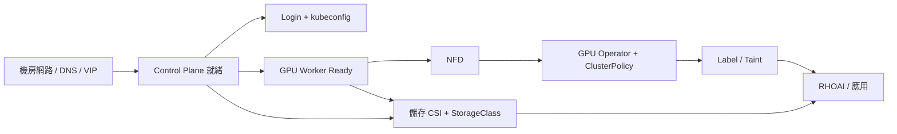

# Module 08: 生產環境 GPU 叢集規劃

> **硬體配置**: Login Node + 8 × GPU Node (每節點 8 × NVIDIA A100 80GB)
> **總 GPU 數量**: 64 × A100 = 5,120 GB GPU Memory
> **適用場景**: 大型語言模型訓練 (LLM)、分散式深度學習、多租戶 AI 平台

---

## 目錄

**建議閱讀順序**（由下而上對應「先想清楚架構與硬體 → 再談網路與作業方式 → 再裝叢集與 GPU → 儲存就緒後上平台與多租戶 → 最後監控與環境對照」）：

1. [叢集架構總覽](#1-叢集架構總覽) — 拓樸與設計原則  
2. [節點硬體與資源規格](#2-節點硬體與資源規格) — Login / Control / GPU Worker、資源加總  
3. [網路架構設計](#3-網路架構設計) — 多平面、Multus、GPUDirect  
4. [作業面：指令位置與節點相依](#4-作業面指令位置與節點相依關係) — 在哪台跑 `oc`、設定先後與相依圖  
5. [OpenShift 叢集規劃](#5-openshift-叢集規劃) — 安裝方式、Label/Taint、MachineSet  
6. [NVIDIA GPU Operator 部署](#6-nvidia-gpu-operator-部署) — NFD、ClusterPolicy、驗證、MIG  
7. [儲存架構設計](#7-儲存架構設計) — 需求、StorageClass、資料流（**建議在 RHOAI 前具備 CSI／SC**）  
8. [RHOAI 完整部署配置](#8-rhoai-完整部署配置) — DSC、Notebook 映像、Workbench 配額  
9. [多租戶與 GPU 排程策略](#9-多租戶與-gpu-排程策略) — Kueue、Quota、PriorityClass  
10. [監控與告警](#10-監控與告警) — DCGM、Grafana、PrometheusRule  
11. [與 CRC 環境的差異對照](#11-與-crc-環境的差異對照)  
- [附錄 A：除錯指令速查](#附錄-a-生產環境除錯指令速查)｜[附錄 B：成本估算](#附錄-b-成本估算參考)

**相關文件** → [模組 09：從 SLURM GPU 叢集遷移至 OCP — 安裝與遷移指南](09-slurm-to-ocp-gpu-migration.md)（若你目前是 SLURM 環境、要改裝為 OCP，請從該篇依序執行。）｜[模組 10：OCP 架構下如何研發](10-ocp-architecture-rd.md)（平台就緒後的研發路線：CorrDiff、LLM、GPU 運算、ML 流程、OpenClaw 等。）

### 編排說明（為何調整章節順序）

- **硬體與容量（§2）先於網路與平台**：讀者先對「有哪些節點、各負責什麼」有具體數字，再讀 **§3 網路** 時較易對應管理網／高速網／儲存網。  
- **§4 作業面獨立**：「在哪台執行 `oc`、各角色設定與相依」集中一處，避免與硬體表混在一起；文中交叉引用之 **§5～§10**（叢集、GPU、儲存、RHOAI、多租戶、監控）仍涵蓋**全部**原有 YAML／指令內容，**僅章號隨順序重編**；**§11** 為 CRC 對照。  
- **GPU Operator（§6）後接儲存（§7）再接 RHOAI（§8）**：與實務上「節點可排程 GPU → PVC 可綁定 → Workbench／Pipeline 才穩」的除錯順序一致；**並未刪減**原 RHOAI 或儲存章節的任何段落。  
- **多租戶（§9）→ 監控（§10）→ CRC 對照（§11）**：由治理與觀測收尾，附錄維持速查與成本。

---

## 1. 叢集架構總覽

### 1.1 架構拓撲圖

```
                         ┌─────────────────────────────────┐
                         │         External Network         │
                         │       (使用者 / API 存取)        │
                         └──────────────┬──────────────────┘
                                        │
                         ┌──────────────▼──────────────────┐
                         │      Login Node (Bastion)        │
                         │   跳板機 / 管理入口 / CLI 操作    │
                         └──────────────┬──────────────────┘
                                        │
                    ┌───────────────────┼───────────────────┐
                    │           Management Network          │
                    │          (10 GbE / 25 GbE)           │
         ┌──────────┼──────────┬───────────┬───────────┐
         ▼          ▼          ▼           ▼           ▼
    ┌─────────┐┌─────────┐┌─────────┐          ┌──────────┐
    │Control-1││Control-2││Control-3│   ...     │ Infra-1  │
    │ Master  ││ Master  ││ Master  │          │(optional)│
    └─────────┘└─────────┘└─────────┘          └──────────┘
                    │
         ┌──────────┼──────────────────────────────────┐
         │         High-Speed GPU / Storage Network     │
         │        (100 GbE / InfiniBand HDR 200 Gb/s)  │
    ┌────┼────┬────┼────┬────┼────┬────┼────┐
    ▼         ▼         ▼         ▼         ▼
┌────────┐┌────────┐┌────────┐┌────────┐┌────────┐
│ GPU-01 ││ GPU-02 ││ GPU-03 ││ GPU-04 ││  ...   │  × 8 nodes
│8×A100  ││8×A100  ││8×A100  ││8×A100  ││8×A100  │
└────────┘└────────┘└────────┘└────────┘└────────┘
                    │
         ┌──────────┼──────────┐
         ▼                     ▼
    ┌──────────┐         ┌──────────┐
    │ Storage  │         │ Storage  │
    │ Server 1 │         │ Server 2 │
    │(Ceph/NFS)│         │(Lustre)  │
    └──────────┘         └──────────┘
```

### 1.2 設計原則

| 原則 | 說明 |
|:---|:---|
| **分離關注點** | Control Plane 與 GPU Worker 完全分離，避免管理負載影響訓練任務 |
| **高可用性** | 3 Master 確保 etcd 仲裁 (quorum)，避免單點故障 |
| **網路分層** | 管理流量 (10/25G) 與 GPU 通訊 (100G/IB) 走不同網路 |
| **可擴展性** | GPU Worker 可隨需增減，不影響 Control Plane |
| **資源隔離** | 透過 Namespace + ResourceQuota + Priority 實現多租戶隔離 |

---

## 2. 節點硬體與資源規格

> 各節點上要跑哪些指令、`oc` 應從哪台執行，以及彼此相依順序，已集中至 [§4 作業面](#4-作業面指令位置與節點相依關係)。

### 2.1 Login Node (Bastion / 跳板機)

```
用途：管理入口、CLI 操作、kubectl/oc 代理
不加入 OpenShift 叢集，僅作為外部存取的安全閘道
```

| 項目 | 建議規格 |
|:---|:---|
| **CPU** | 8 核 (Intel Xeon / AMD EPYC) |
| **RAM** | 32 GB |
| **Disk** | 500 GB SSD |
| **Network** | 10 GbE × 2 (管理 + 備援) |
| **OS** | RHEL 9.x |
| **軟體** | oc CLI, helm, podman, ssh, VPN |

**執行位置說明：**

| 區塊 | 在哪裡執行 |
|:---|:---|
| `export` / `oc cluster-info` / `oc get nodes` | **Login Node**（或與 Login 等價、已放 kubeconfig 的管理主機） |
| `ssh -L 8443:... admin@login-node` | **你的筆電／工作站**（SSH **客戶端**）；`admin@login-node` 為跳板帳號與主機名，請替換為實際值 |

```bash
# Login Node 上設定 kubeconfig
export KUBECONFIG=/path/to/cluster/kubeconfig

# 驗證叢集連通
oc cluster-info
oc get nodes

# 透過 SSH Tunnel 存取 Dashboard (如果無 Public Route)
# 下列 ssh 在「本機」執行，遠端為 Login Node
ssh -L 8443:api.cluster.example.com:6443 admin@login-node
```

### 2.2 Control Plane Nodes (Master × 3)

```
用途：運行 API Server, etcd, Scheduler, Controller Manager
不執行使用者工作負載，專責叢集管理
```

| 項目 | 建議規格 |
|:---|:---|
| **CPU** | 16 核 (Intel Xeon Gold / AMD EPYC) |
| **RAM** | 64 GB |
| **System Disk** | 500 GB NVMe SSD |
| **etcd Disk** | 500 GB NVMe SSD (**獨立磁碟！**) |
| **Network** | 25 GbE × 2 (Bond) |
| **OS** | RHCOS (Red Hat CoreOS) |

> ⚠️ **重要**：etcd 對磁碟延遲極其敏感。**務必使用獨立的 NVMe SSD**，不可與系統磁碟共用。etcd 延遲超過 10ms 會導致 Leader 選舉風暴。

### 2.3 GPU Worker Nodes (× 8)

```
用途：執行 AI/ML 訓練、推論、Jupyter Notebook 等 GPU 工作負載
這是叢集中最核心的運算資源
```

| 項目 | 建議規格 |
|:---|:---|
| **CPU** | 128 核 (AMD EPYC 9654 / Intel Xeon w9-3495X) |
| **RAM** | 1 TB (1024 GB) DDR5 |
| **GPU** | 8 × NVIDIA A100 80GB SXM4 |
| **GPU Interconnect** | NVSwitch (節點內 GPU-GPU 600 GB/s) |
| **System Disk** | 2 TB NVMe SSD |
| **Local Scratch** | 4 × 3.84 TB NVMe SSD (RAID0, 用於暫存) |
| **Network** | 25 GbE (管理) + 100 GbE / InfiniBand HDR (GPU 通訊) |
| **OS** | RHCOS (Red Hat CoreOS) |

> 💡 **為什麼 1 TB RAM？** 大型模型訓練時，數據載入 (DataLoader) 會大量使用 CPU 記憶體做預處理。RAM 不足會成為 GPU 利用率的瓶頸。

### 2.4 資源總覽

| 資源 | 單節點 | 全叢集 (8 Node) |
|:---|:---|:---|
| **GPU** | 8 × A100 80GB | **64 × A100 = 5,120 GB VRAM** |
| **CPU** | 128 核 | **1,024 核** |
| **RAM** | 1 TB | **8 TB** |
| **NVMe Scratch** | ~15 TB | **~120 TB** |
| **GPU 通訊頻寬** | 600 GB/s (NVSwitch 節點內) | 100/200 Gb/s (跨節點 IB/RoCE) |

---

## 3. 網路架構設計

### 3.1 網路拓樸圖（邏輯視圖）

下列圖示與 [§1.1 架構拓撲圖](#11-架構拓撲圖) 一致，補強 **Control Plane、GPU Worker、儲存** 在各網路平面上的關係。實體機櫃／ToR 層級請以機房設計為準。

> **檢視方式**：GitHub、GitLab、VS Code（Mermaid 外掛）或站內 HTML 圖表頁可渲染；純文字閱讀器請搭配 §1.1 ASCII 圖。



| 連線類型 | 承載內容 |
|:---|:---|
| **Management** | `oc`/`kubectl`、API、節點與控制面信令、Ingress、一般監控與 SSH |
| **GPU / Storage 高速網** | 跨節點 NCCL、分散式訓練、GPUDirect RDMA、大流量資料集／並行檔案系統 I/O |
| **Pod 雙網（概念）** | 預設 Pod 網由叢集 CNI 提供；訓練 Pod 經 **Multus** 再掛高速網介面（見 §3.3 範例） |

### 3.2 多網路設計

生產環境 GPU 叢集需要 **至少 3 個獨立網路**：

```
┌────────────────────────────────────────────────────────┐
│                   Network Architecture                  │
├──────────────┬─────────────┬───────────────────────────┤
│  Management  │   Storage   │    GPU Interconnect       │
│   Network    │   Network   │    Network                │
├──────────────┼─────────────┼───────────────────────────┤
│  10/25 GbE   │  25/100 GbE │  100 GbE / IB HDR 200G   │
├──────────────┼─────────────┼───────────────────────────┤
│ API Server   │ Ceph / NFS  │ NCCL AllReduce            │
│ Dashboard    │ PVC Mount   │ Distributed Training      │
│ SSH / Admin  │ Dataset I/O │ Gradient Sync             │
│ Monitoring   │ Model Store │ Multi-node GPU Comm       │
└──────────────┴─────────────┴───────────────────────────┘
```

### 3.3 OpenShift 多網路配置 (Multus)

OpenShift 使用 **Multus CNI** 支援多網路附掛，讓 GPU Pod 同時連接管理網路和高速網路：

**執行位置**：**Login Node**（或具 `oc`、**cluster-admin** 的管理主機）。將下列 YAML 存成檔案後執行 `oc apply -f <檔案>`；**勿**在 GPU Worker 上直接編輯節點網路取代叢集內 CR。

```yaml
# NetworkAttachmentDefinition - GPU 高速網路
apiVersion: k8s.cni.cncf.io/v1
kind: NetworkAttachmentDefinition
metadata:
  name: gpu-rdma-network
  namespace: ai-training
spec:
  config: |
    {
      "cniVersion": "0.3.1",
      "type": "host-device",
      "device": "ib0",
      "ipam": {
        "type": "static",
        "addresses": [
          { "address": "10.10.0.0/24" }
        ]
      }
    }
```

**執行位置**：建立工作負載的命名空間後，於 **Login Node** 以 `oc apply -f` 套用（或由 **CI/CD** 以相同 kubeconfig 套用）。實際 Pod 會被 **Scheduler 排到 GPU Worker**。

```yaml
# Pod 掛載雙網路
apiVersion: v1
kind: Pod
metadata:
  name: gpu-training
  annotations:
    k8s.v1.cni.cncf.io/networks: gpu-rdma-network
spec:
  containers:
  - name: trainer
    resources:
      limits:
        nvidia.com/gpu: 8        # 使用全部 8 GPU
        rdma/rdma_shared_device_a: 1  # RDMA 裝置
```

### 3.4 GPUDirect RDMA

A100 支援 **GPUDirect RDMA**，允許 GPU 直接透過 InfiniBand 讀寫遠端 GPU 記憶體，跳過 CPU：

```
傳統路徑：  GPU → CPU → NIC → Network → NIC → CPU → GPU
GPUDirect：  GPU → NIC → Network → NIC → GPU  (CPU 不參與!)
```

> 這對大型分散式訓練 (如 Megatron-LM, DeepSpeed) 的效能至關重要。需要在 GPU Operator 中啟用 `driver.rdma.enabled: true`（見 **§6** ClusterPolicy）。

---

## 4. 作業面：指令位置與節點相依關係

### 4.1 指令要在哪台機器執行？

本文件所有 **`oc` / `kubectl` / `openshift-install`** 類指令，若未另註明，預設規則如下：

| 執行環境 | 用途 | 典型指令 | 備註 |
|:---|:---|:---|:---|
| **Login Node（跳板機）** | 日常叢集管理、套用 YAML、除錯、CI runner | `oc apply`、`oc get`、`oc adm`、`helm` | **主要工作位置**；需安裝 `oc`、可連 **API VIP:6443**、`KUBECONFIG` 指向具 **cluster-admin**（或足夠 RBAC）的 kubeconfig |
| **安裝用工作站／自動化主機** | **首次安裝** OpenShift（IPI / UPI / Agent） | `openshift-install create cluster`、`openshift-install wait-for` | 僅安裝階段；安裝完成後仍建議改在 **Login Node** 做日常操作 |
| **開發者筆電** | 連線、隧道、瀏覽器開 Console | `ssh -L ...`、`curl` 測 API | **不**在筆電上對生產叢集執行大量 `oc apply`（除非 kubeconfig 與權限由組織允許且網路可達） |
| **Control Plane（RHCOS）** | **不**作為日常 CLI 入口 | 僅在 Red Hat / 廠商支援指引下排查 `etcd`、`kubelet` | **勿**在 master 上習慣性跑 `oc` 或改叢集狀態 |
| **GPU Worker（RHCOS）** | **不**執行 `oc apply` | 除錯用 `oc debug node/<name>`，或依政策 SSH 查 **NVIDIA / MOFED** | 應用與 Operator 由叢集排程，非人工 SSH 裝套件 |
| **叢集內 Pod** | 驗證 GPU、看指標 | `oc exec ... -- nvidia-smi`、`dcgmi` | **觸發端**仍在 Login（或 CI）：你在外部下 `oc exec`，實際程式在 Pod 內跑 |

**權限與網路**：多數範例需 **cluster-admin**。若使用 **Dedicated / ROSA**，部分 `openshift-*` namespace 可能受限，請改依雲端廠商文件操作。

### 4.2 各節點設定與相依關係

本節回答兩件事：**不同角色各自要做哪些設定**，以及**先後／前提（相依性）**為何。細部 YAML 分散於後續 **§5**（叢集與節點策略）、**§6**（GPU Operator）、**§7**（儲存）、**§8**（RHOAI）、**§9**（多租戶／Kueue）、**§10**（監控）；**§3** 為網路與 Multus 範例。此處為總表與順序心智模型。

#### 4.2.1 分角色：設定項目一覽

| 角色 | 機房／OS 層（Day-0） | 叢集／平台層（Day-1+） | 備註 |
|:---|:---|:---|:---|
| **Login Node** | RHEL 安裝、帳號與 **sudo** 政策、防火牆允許 **出站 → API VIP:6443**、可選 VPN | 安裝 **`oc`/Helm**、放置 **kubeconfig**、同步 **CA**、自動化 **SSH key** | **不**加入叢集；沒有 API 就無法在此用 `oc` |
| **Control Plane ×3** | **DNS**（api、api-int、*.apps 等）、**VIP/LB**、開機／PXE、磁碟（**系統碟 + 獨立 etcd 碟**）、管理網 Bond | **kube-apiserver、etcd、scheduler、controller** 由安裝與 **MCO** 管理；日常**不**手改 master | 任一 Master 長期 **NotReady** 會影響 **API 可用度** → 全叢集卡住 |
| **Infra（可選）** | 與一般 Worker 類似（無 GPU） | **Taint/Toleration** 讓 Ingress、Registry、監控等只排到此類節點（依組織政策） | 無 Infra 時，上述元件可落在 **GPU Worker**（不建議）或 **共用 Worker** |
| **GPU Worker ×8** | 管理網 + **高速網（IB/RoCE）** 佈線、BMC、本地 **NVMe / Scratch**、GPU **韌體／驗證模式**、若用 host MOFED 則 **與 ClusterPolicy 對齊** | 節點 **Ready**、**§5.2** label/taint、**§6** NFD → GPU Operator → **ClusterPolicy**、可選 **MIG** label、**§3.3 Multus** 所需 **主機介面名稱**、**§7** Local PV 路徑與權限 | 設定錯誤時常見現象：**Unschedulable**、**驱动 Pod CrashLoop**、**無 nvidia.com/gpu**、**PVC 無法掛載** |
| **儲存後端**（Ceph、NFS、Lustre、S3…） | 網段與 **防火牆** 允許 **Worker（或 CSI Pod 所在節點）** 存取 | 在叢集內部署 **CSI / Operator** 或 **OC Storage**，建立 **StorageClass**（**§7**）；之後 **PVC** 才會 **Bound** | 與 GPU **無直接驅動相依**，但 **有 PVC 的工作負載** 依賴儲存先好 |

#### 4.2.2 相依性（先後與前提）

**硬相依（上一層不成立則下一層必敗）**

1. **機房 L2/L3 + DNS + API VIP** → 否則 **安裝程式與 kubelet** 無法對齊叢集端點。  
2. **Control Plane 就緒、API Server 健康** → 才有 **`oc`、CSR 簽署、節點加入**。  
3. **GPU Worker `Ready`**（管理網通、kubelet 正常）→ 才能在其上跑 **GPU Operator 的 DaemonSet**（驅動、device plugin、DCGM）。  
4. **NFD（建議先裝）** → 節點上才有穩定 **feature label**，利於 **NodeFeatureRule / GPU Operator** 選節點（見 **§6**）。  
5. **ClusterPolicy / driver container 成功** → 節點才會回報 **`nvidia.com/gpu`**，`Pod` 才可請求 GPU。  
6. **StorageClass + 後端連通** → 需要 **PVC** 的 Pod（Notebook、Registry、部分 Pipeline）才會 **Bound**（**§7**）。

**軟相依（建議順序，便於除錯）**

- **§5.2 label/taint** 宜在 **確認 GPU Operator 已把資源掛上節點** 之後再做，否則排程錯誤不易分辨是「沒 GPU」還是「被 taint 擋」。  
- **§3.3 Multus** 依賴 **主機上實體介面已存在且名稱與 NAD 一致**（例如 `ib0`）；與 **OVN 預設 Pod 網** 獨立。  
- **§8 RHOAI / DSC** 依賴 **Operator 來自 Catalog 可拉映像**、**Worker 有足夠 CPU/RAM**、**Ingress／Route** 可服務（常與 Infra 或節點角色有關）。  
- **§9 Kueue** 依賴 **叢集已安裝 Kueue CRD**（通常由 RHOAI 或獨立 Operator 帶入），且 **ResourceQuota** 與團隊命名空間已建立。

#### 4.2.3 相依關係圖（簡化）



> **讀圖**：`ST`（儲存）與 `GPU` 分支可部分**並行**，但 **「會掛 PVC 的 GPU Job」** 必須兩邊都滿足。`LN` 僅代表**管理路徑**；實際運算與儲存資料流在 Worker 與儲存後端之間。

---

## 5. OpenShift 叢集規劃

### 5.1 安裝方式選擇

| 安裝方式 | 適用場景 | 建議 |
|:---|:---|:---|
| **IPI (Installer-Provisioned)** | 公有雲 / 虛擬化平台 | AWS, Azure, vSphere |
| **UPI (User-Provisioned)** | 裸機 GPU 叢集 | ✅ **推薦用於 A100 叢集** |
| **Agent-Based** | 離線 / Air-Gap 環境 | 安全隔離的 GPU 叢集 |

> **安裝階段指令在哪跑**：`openshift-install`、`openshift-baremetal-install` 等通常在 **安裝用工作站** 或 **自動化 jump host** 執行；叢集就緒後的 **Node / Operator / 應用** 設定一律建議在 **Login Node** 用 `oc` 完成。

### 5.2 Node Label 與 Taint 策略

**執行位置**：**Login Node**（`oc` + **cluster-admin** kubeconfig）。節點名 `gpu-worker-01`… 請替換為 `oc get nodes` 實際名稱。

```bash
# 為 GPU 節點打標籤
oc label node gpu-worker-{01..08} \
  node-role.kubernetes.io/gpu-worker="" \
  nvidia.com/gpu.product="A100-SXM4-80GB" \
  cluster.example.com/node-type=gpu

# 設定 Taint 防止非 GPU 工作負載調度到 GPU 節點
oc adm taint nodes gpu-worker-{01..08} \
  nvidia.com/gpu=present:NoSchedule

# 確認標籤
oc get nodes -l nvidia.com/gpu.product=A100-SXM4-80GB
```

> 🔑 **Taint 的意義**：確保昂貴的 GPU 節點不會被一般的 Web 服務或監控 Pod 佔用。只有帶有 `tolerations` 的 GPU 工作負載才能被調度上來。

### 5.3 MachineSet 定義 (如使用 IPI)

**執行位置**：**Login Node**；`oc apply -f machineset-gpu.yaml`（需有 **cluster-admin** 或 `openshift-machine-api` 相關權限）。**裸機 UPI** 常改以 **BareMetalHost** 裝節點，未必使用本節 MachineSet。

```yaml
apiVersion: machine.openshift.io/v1beta1
kind: MachineSet
metadata:
  name: gpu-worker
  namespace: openshift-machine-api
spec:
  replicas: 8
  selector:
    matchLabels:
      machine.openshift.io/cluster-api-machineset: gpu-worker
  template:
    metadata:
      labels:
        machine.openshift.io/cluster-api-machineset: gpu-worker
    spec:
      metadata:
        labels:
          node-role.kubernetes.io/gpu-worker: ""
      taints:
        - key: nvidia.com/gpu
          value: present
          effect: NoSchedule
      providerSpec:
        # 根據您的平台 (vSphere, Bare Metal, AWS) 填寫
        # 裸機環境通常使用 BareMetalHost CR
```

---

## 6. NVIDIA GPU Operator 部署

### 6.1 安裝流程

**執行位置**：**Login Node**（`oc` + **cluster-admin**）。下列以 `oc apply -f - <<EOF` 內嵌清單；亦可改為存成檔案後 `oc apply -f`。

```bash
# Step 1: 安裝 Node Feature Discovery (NFD) Operator
# 用於自動偵測節點上的 GPU 硬體
oc apply -f - <<EOF
apiVersion: operators.coreos.com/v1alpha1
kind: Subscription
metadata:
  name: nfd
  namespace: openshift-nfd
spec:
  channel: "stable"
  name: nfd
  source: redhat-operators
  sourceNamespace: openshift-marketplace
EOF

# Step 2: 建立 NFD Instance
oc apply -f - <<EOF
apiVersion: nfd.openshift.io/v1
kind: NodeFeatureDiscovery
metadata:
  name: nfd-instance
  namespace: openshift-nfd
spec:
  operand:
    image: registry.redhat.io/openshift4/ose-node-feature-discovery
EOF

# Step 3: 安裝 NVIDIA GPU Operator
oc apply -f - <<EOF
apiVersion: operators.coreos.com/v1alpha1
kind: Subscription
metadata:
  name: gpu-operator-certified
  namespace: nvidia-gpu-operator
spec:
  channel: "v24.6"
  name: gpu-operator-certified
  source: certified-operators
  sourceNamespace: openshift-marketplace
  installPlanApproval: Manual
EOF
```

### 6.2 ClusterPolicy 配置

**執行位置**：**Login Node**；`oc apply -f clusterpolicy.yaml`。**MOFED / IB** 若設 `useHostMofed: true`，須先在 **GPU Worker 映像或 Day-2 機制** 上備妥驅動（本文件不涵蓋 OS 層手動編譯；生產環境多與廠商基線映像一併交付）。

```yaml
apiVersion: nvidia.com/v1
kind: ClusterPolicy
metadata:
  name: gpu-cluster-policy
spec:
  operator:
    defaultRuntime: crio
  
  driver:
    enabled: true
    rdma:
      enabled: true        # 啟用 GPUDirect RDMA
      useHostMofed: true    # 使用宿主機的 MOFED 驅動
    version: "550.127.05"   # 指定驅動版本
  
  devicePlugin:
    enabled: true
    config:
      name: device-plugin-config
      default: a100-config
  
  dcgmExporter:
    enabled: true           # DCGM 監控 GPU 指標
  
  dcgm:
    enabled: true
  
  gfd:                      # GPU Feature Discovery
    enabled: true
  
  mig:                      # Multi-Instance GPU (可選)
    strategy: mixed         # none / single / mixed
  
  toolkit:
    enabled: true
  
  validator:
    plugin:
      env:
        - name: WITH_WORKLOAD
          value: "true"     # 部署時自動驗證 GPU 可用性
```

### 6.3 驗證 GPU 可用

**執行位置**：**Login Node**。`oc exec` 的目標 Pod 在 **叢集內**（`nvidia-gpu-operator` 命名空間），由控制面轉發到實際 Worker 節點。

```bash
# 檢查 NFD 是否偵測到 GPU
oc get nodes -o json | jq '.items[].metadata.labels' | grep nvidia

# 檢查 GPU Operator Pod 狀態
oc get pods -n nvidia-gpu-operator

# 驗證 GPU 資源已註冊
oc describe node gpu-worker-01 | grep -A 5 "nvidia.com/gpu"
# 預期輸出:
#   nvidia.com/gpu: 8
#   nvidia.com/gpu.memory: 81920
#   nvidia.com/gpu.product: A100-SXM4-80GB

# 使用 nvidia-smi 驗證
oc exec -n nvidia-gpu-operator $(oc get pods -n nvidia-gpu-operator -l app=nvidia-driver-daemonset -o name | head -1) -- nvidia-smi
```

### 6.4 MIG (Multi-Instance GPU) — 切割 A100

A100 支援 **MIG** 技術，可將一張 GPU 切割成最多 7 個獨立實例：

```
┌───────────────────────── A100 80GB ──────────────────────────┐
│                                                               │
│  ┌─────────┐ ┌─────────┐ ┌─────────┐ ┌─────────┐            │
│  │ 1g.10gb │ │ 1g.10gb │ │ 1g.10gb │ │ 1g.10gb │  7 × 1g   │
│  └─────────┘ └─────────┘ └─────────┘ └─────────┘            │
│  ┌─────────┐ ┌─────────┐ ┌─────────┐                        │
│  │ 1g.10gb │ │ 1g.10gb │ │ 1g.10gb │                        │
│  └─────────┘ └─────────┘ └─────────┘                        │
│                    或                                         │
│  ┌─────────────────────┐ ┌─────────────────────┐            │
│  │     3g.40gb         │ │      4g.40gb        │   2 大切割  │
│  └─────────────────────┘ └─────────────────────┘            │
│                    或                                         │
│  ┌───────────────────────────────────────────────┐          │
│  │              7g.80gb (完整 GPU)                 │  不切割  │
│  └───────────────────────────────────────────────┘          │
└───────────────────────────────────────────────────────────────┘
```

**使用場景建議**：

| 模式 | 切割方式 | 適用場景 |
|:---|:---|:---|
| **不切割** | 7g.80gb | LLM 訓練、大模型推論 |
| **2 切割** | 3g.40gb + 4g.40gb | 中型模型開發 + 推論 |
| **7 切割** | 7 × 1g.10gb | Jupyter Notebook、教學環境 |

**執行位置**：**Login Node**（**cluster-admin** 或具節點 `patch` 權限者）。變更後節點可能短暫 **NotReady**（驅動/GPU Operator 重配）。

```bash
# 啟用 MIG 模式 (在特定節點)
oc label node gpu-worker-08 nvidia.com/mig.config=all-1g.10gb

# 查看 MIG 裝置
oc describe node gpu-worker-08 | grep "nvidia.com/mig"
# nvidia.com/mig-1g.10gb: 56  (8 GPU × 7 切割)
```

---

## 7. 儲存架構設計

### 7.1 儲存需求分析

| 用途 | 存取模式 | 容量需求 | I/O 特性 | 建議方案 |
|:---|:---|:---|:---|:---|
| **模型訓練數據集** | ReadOnlyMany (ROX) | 10~100 TB | 高吞吐量、循序讀取 | Lustre / GPFS / BeeGFS |
| **模型 Checkpoint** | ReadWriteOnce (RWO) | 1~10 TB/job | 突發大檔寫入 | NVMe Local Scratch |
| **Notebook 工作目錄** | ReadWriteOnce (RWO) | 50~200 GB/user | 隨機 I/O | Ceph RBD |
| **模型儲存/Registry** | ReadWriteMany (RWX) | 5~50 TB | 低 I/O、長期保存 | S3 (MinIO/Ceph RGW) |
| **Pipeline Artifacts** | ReadWriteMany (RWX) | 1~5 TB | 中等 I/O | Ceph FS / NFS |

### 7.2 StorageClass 配置

**執行位置**：**Login Node**（**cluster-admin** 或具 `storageclasses`、CSI 相關權限）。`no-provisioner` 的 Local PV 還需在 **各 Worker** 預先準備磁碟與 PV 物件（本 YAML 僅為 StorageClass 範例）。

```yaml
# 高效能 NVMe 本地儲存 (訓練 Scratch)
apiVersion: storage.k8s.io/v1
kind: StorageClass
metadata:
  name: nvme-scratch
provisioner: kubernetes.io/no-provisioner
volumeBindingMode: WaitForFirstConsumer  # 確保 Pod 和 PV 在同一節點
reclaimPolicy: Delete

---
# Ceph RBD (Notebook 持久化)
apiVersion: storage.k8s.io/v1
kind: StorageClass
metadata:
  name: ceph-rbd
  annotations:
    storageclass.kubernetes.io/is-default-class: "true"
provisioner: openshift-storage.rbd.csi.ceph.com
parameters:
  clusterID: openshift-storage
  pool: ocs-storagecluster-cephblockpool
  imageFormat: "2"
  imageFeatures: layering
reclaimPolicy: Delete
allowVolumeExpansion: true

---
# S3 Compatible (MinIO) for Model Registry
apiVersion: objectbucket.io/v1alpha1
kind: ObjectBucketClaim
metadata:
  name: model-store
  namespace: rhoai-model-registries
spec:
  bucketName: rhoai-models
  storageClassName: openshift-storage.noobaa.io
```

### 7.3 資料流架構

```
                    ┌──────────────────┐
                    │   Object Store   │
                    │  (S3 / MinIO)    │
                    │  模型存放、Pipeline │
                    └────────┬─────────┘
                             │ S3 API
         ┌───────────────────┼──────────────────────┐
         ▼                   ▼                      ▼
    ┌──────────┐      ┌──────────┐          ┌──────────────┐
    │  Model   │      │ Pipeline │          │   Jupyter     │
    │  Serving │      │  Server  │          │  Notebooks    │
    │ (KServe) │      │  (KFP)   │          │  (Workbench)  │
    └──────────┘      └──────────┘          └──────┬───────┘
                                                    │
                                            ┌───────▼────────┐
                                            │  Ceph RBD PVC  │
                                            │ (用戶工作目錄)  │
                                            └────────────────┘
         ┌─────────────────────────────────────────┐
         │     Shared Dataset (Lustre / GPFS)      │
         │   /mnt/datasets  (ReadOnlyMany)          │
         │   ImageNet, Common Crawl, Custom Data    │
         └─────────────────────────────────────────┘
```

---

## 8. RHOAI 完整部署配置

### 8.1 DataScienceCluster (全功能啟用)

與 CRC 精簡版不同，生產環境應**啟用所有組件**：

**執行位置**：**Login Node**；`oc apply -f dsc.yaml`。通常需 **cluster-admin** 或具 **OpenShift AI / ODH Operator** 所要求之 CR 權限。

```yaml
apiVersion: datasciencecluster.opendatahub.io/v1
kind: DataScienceCluster
metadata:
  name: default-dsc
spec:
  components:
    dashboard:
      managementState: Managed
    workbenches:
      managementState: Managed
    datasciencepipelines:
      managementState: Managed
    modelmeshserving:
      managementState: Managed      # ✅ 啟用 (CRC 環境為 Removed)
    kserve:
      managementState: Managed      # ✅ 啟用 (CRC 環境為 Removed)
      serving:
        ingressGateway:
          certificate:
            type: SelfSigned
        managementState: Managed
    ray:
      managementState: Managed      # ✅ 啟用 (CRC 環境為 Removed)
    trustyai:
      managementState: Managed      # ✅ 啟用 (CRC 環境為 Removed)
    trainingoperator:
      managementState: Managed      # ✅ 啟用 (CRC 環境為 Removed)
    kueue:
      managementState: Managed      # ✅ GPU 排程佇列
    modelregistry:
      managementState: Managed
```

### 8.2 Notebook Image 配置

生產環境建議預建 **GPU 專屬映像**：

| 映像名稱 | 內含框架 | GPU 支援 |
|:---|:---|:---|
| `CUDA Data Science` | Python 3.11, CUDA 12.4, pandas, scikit-learn | ✅ |
| `PyTorch` | PyTorch 2.3, CUDA 12.4, transformers | ✅ |
| `TensorFlow` | TensorFlow 2.16, CUDA 12.4 | ✅ |
| `Code Server (VS Code)` | VS Code Server, Python, CUDA | ✅ |
| `Habana (Gaudi)` | Intel Gaudi SDK | Gaudi 專用 |

### 8.3 Workbench GPU 配額配置

**執行位置**：**Login Node**；以 **叢集管理員** 或具該 **Namespace** 管理權限者執行 `oc apply -f`（範例命名空間 `ds-project-team-a` 須已存在）。

```yaml
# 允許使用者在 Notebook 中申請 GPU
apiVersion: v1
kind: ResourceQuota
metadata:
  name: gpu-quota-team-a
  namespace: ds-project-team-a
spec:
  hard:
    requests.nvidia.com/gpu: "8"    # 最多 8 GPU
    requests.cpu: "64"
    requests.memory: "256Gi"
    persistentvolumeclaims: "10"
    pods: "20"
```

---

## 9. 多租戶與 GPU 排程策略

### 9.1 Kueue 排程系統

RHOAI 使用 **Kueue** 做為 GPU 工作負載的排程與佇列系統：

**執行位置**：**Login Node**；`oc apply -f kueue-queues.yaml`（需 **cluster-admin** 或 Kueue CRD 之建立權限）。

```yaml
# ClusterQueue - 定義叢集級 GPU 資源池
apiVersion: kueue.x-k8s.io/v1beta1
kind: ClusterQueue
metadata:
  name: gpu-cluster-queue
spec:
  namespaceSelector: {}
  resourceGroups:
    - coveredResources: ["cpu", "memory", "nvidia.com/gpu"]
      flavors:
        - name: a100-80gb
          resources:
            - name: "nvidia.com/gpu"
              nominalQuota: 64       # 全叢集 64 GPU
            - name: "cpu"
              nominalQuota: 1024
            - name: "memory"
              nominalQuota: "8Ti"

---
# LocalQueue - 團隊級配額
apiVersion: kueue.x-k8s.io/v1beta1
kind: LocalQueue
metadata:
  name: team-a-queue
  namespace: ds-project-team-a
spec:
  clusterQueue: gpu-cluster-queue

---
# ResourceFlavor - A100 GPU 定義
apiVersion: kueue.x-k8s.io/v1beta1
kind: ResourceFlavor
metadata:
  name: a100-80gb
spec:
  nodeLabels:
    nvidia.com/gpu.product: "A100-SXM4-80GB"
  tolerations:
    - key: nvidia.com/gpu
      operator: Exists
      effect: NoSchedule
```

### 9.2 多團隊 GPU 分配範例

```
Total: 64 × A100
├── Team A (研究團隊):   24 GPU (37.5%)  ← 大型 LLM 訓練
├── Team B (產品團隊):   16 GPU (25.0%)  ← 模型微調 + 推論
├── Team C (資料團隊):    8 GPU (12.5%)  ← 資料處理 + 小模型
├── Shared Pool:         16 GPU (25.0%)  ← 搶佔式、任何團隊可用
```

**執行位置**：**Login Node**；各 `ResourceQuota` 套用在對應 **Namespace**（須已建立）。

```yaml
# Team A - 大配額
apiVersion: v1
kind: ResourceQuota
metadata:
  name: team-a-gpu-quota
  namespace: ds-project-team-a
spec:
  hard:
    requests.nvidia.com/gpu: "24"
    limits.nvidia.com/gpu: "24"

---
# Team B - 中配額
apiVersion: v1
kind: ResourceQuota
metadata:
  name: team-b-gpu-quota
  namespace: ds-project-team-b
spec:
  hard:
    requests.nvidia.com/gpu: "16"
    limits.nvidia.com/gpu: "16"
```

### 9.3 Priority Class (優先權等級)

**執行位置**：**Login Node**（**cluster-admin**）；`oc apply -f priorityclasses.yaml`。

```yaml
# 高優先權 - 生產推論服務
apiVersion: scheduling.k8s.io/v1
kind: PriorityClass
metadata:
  name: production-serving
value: 1000000
globalDefault: false
description: "生產環境推論服務，不可被搶佔"
preemptionPolicy: Never

---
# 中優先權 - 訓練任務
apiVersion: scheduling.k8s.io/v1
kind: PriorityClass
metadata:
  name: training-job
value: 100000
globalDefault: false
description: "訓練任務，可搶佔低優先權工作"
preemptionPolicy: PreemptLowerPriority

---
# 低優先權 - Jupyter Notebook (可被搶佔)
apiVersion: scheduling.k8s.io/v1
kind: PriorityClass
metadata:
  name: interactive-notebook
value: 10000
globalDefault: true
description: "互動式 Notebook，可被訓練任務搶佔"
preemptionPolicy: PreemptLowerPriority
```

---

## 10. 監控與告警

### 10.1 DCGM (Data Center GPU Manager) 指標

GPU Operator 會自動部署 **DCGM Exporter**，將 GPU 指標暴露給 Prometheus：

| 指標名稱 | 說明 | 告警閾值 |
|:---|:---|:---|
| `DCGM_FI_DEV_GPU_UTIL` | GPU 核心使用率 (%) | < 10% 持續 30min (閒置告警) |
| `DCGM_FI_DEV_MEM_COPY_UTIL` | 記憶體頻寬使用率 (%) | > 95% (瓶頸告警) |
| `DCGM_FI_DEV_FB_USED` | 已使用的 GPU 記憶體 (MB) | > 95% (OOM 風險) |
| `DCGM_FI_DEV_GPU_TEMP` | GPU 溫度 (°C) | > 85°C (過熱告警) |
| `DCGM_FI_DEV_POWER_USAGE` | GPU 功耗 (W) | > 350W (接近 400W TDP) |
| `DCGM_FI_DEV_XID_ERRORS` | GPU XID 錯誤 | > 0 (硬體異常告警) |

### 10.2 Grafana Dashboard

**執行位置**：**Login Node**；需 **cluster-admin**（或具 `openshift-monitoring` namespace 寫入權限）。請先將 Dashboard JSON 存成本機 `gpu-dashboard.json`（與 `oc` 同目錄或改用絕對路徑）。

```bash
# 匯入 NVIDIA DCGM Dashboard (ID: 12239)
# OpenShift 已內建 Grafana，透過 ConfigMap 匯入

oc create configmap gpu-dashboard \
  --from-file=gpu-dashboard.json \
  -n openshift-monitoring
```

### 10.3 PrometheusRule 告警範例

**執行位置**：**Login Node**；`oc apply -f gpu-alerts.yaml`（**cluster-admin** 或監控 Operator 允許之權限）。

```yaml
apiVersion: monitoring.coreos.com/v1
kind: PrometheusRule
metadata:
  name: gpu-alerts
  namespace: openshift-monitoring
spec:
  groups:
    - name: gpu.rules
      rules:
        - alert: GPUHighTemperature
          expr: DCGM_FI_DEV_GPU_TEMP > 85
          for: 5m
          labels:
            severity: warning
          annotations:
            summary: "GPU 溫度過高 {{ $labels.gpu }} on {{ $labels.node }}"
            description: "GPU 溫度 {{ $value }}°C，超過 85°C 閾值"

        - alert: GPUMemoryAlmostFull
          expr: DCGM_FI_DEV_FB_USED / DCGM_FI_DEV_FB_TOTAL > 0.95
          for: 10m
          labels:
            severity: critical
          annotations:
            summary: "GPU 記憶體即將耗盡"

        - alert: GPUIdleWaste
          expr: DCGM_FI_DEV_GPU_UTIL < 10
          for: 30m
          labels:
            severity: info
          annotations:
            summary: "GPU 閒置超過 30 分鐘，可能造成資源浪費"

        - alert: GPUXidError
          expr: DCGM_FI_DEV_XID_ERRORS > 0
          for: 1m
          labels:
            severity: critical
          annotations:
            summary: "GPU 硬體錯誤 (XID {{ $value }})"
            description: "節點 {{ $labels.node }} 偵測到 GPU XID 錯誤，可能需要更換 GPU"
```

---

## 11. 與 CRC 環境的差異對照

| 項目 | CRC (開發環境) | 生產 GPU 叢集 |
|:---|:---|:---|
| **節點數** | 1 (單節點) | 11+ (3 Master + 8 GPU Worker) |
| **CPU** | 8 vCPU | 1,024+ 核 |
| **RAM** | 20 GiB | 8+ TiB |
| **GPU** | ❌ 無 | 64 × A100 80GB |
| **磁碟** | 31 GiB | 120+ TB NVMe |
| **網路** | NAT (單一) | 3 層分離 (管理/儲存/GPU) |
| **儲存** | hostpath-provisioner | Ceph + NVMe + S3 |
| **DSC 組件** | 精簡 (5 組件) | 全功能 (10+ 組件) |
| **KServe** | Removed | ✅ Managed |
| **Ray** | Removed | ✅ Managed |
| **Kueue** | 不需要 | ✅ GPU 排程佇列 |
| **MIG** | N/A | 可選 (Jupyter 共享 GPU) |
| **監控** | 基礎 | DCGM + Prometheus + Grafana |
| **多租戶** | 單一使用者 | ResourceQuota + Priority + Kueue |
| **安裝方式** | `crc start` | UPI / Agent-Based |
| **除錯重點** | 記憶體/磁碟不足 | GPU 排程、NCCL 通訊、驅動相容 |

---

## 附錄 A: 生產環境除錯指令速查

**執行位置**：預設皆在 **Login Node**（`oc` + 可讀取叢集狀態之 kubeconfig）。`oc exec` 列為「由 Login 觸發、在指定 Pod 內執行」。

```bash
# === GPU 狀態 ===
# 查看所有節點的 GPU 資源
oc get nodes -o custom-columns=\
  NAME:.metadata.name,\
  GPU:.status.allocatable.'nvidia\.com/gpu',\
  CPU:.status.allocatable.cpu,\
  MEM:.status.allocatable.memory

# 查看 GPU 使用率 (需先 exec 進 DCGM Pod)
oc exec -n nvidia-gpu-operator \
  $(oc get pod -n nvidia-gpu-operator -l app=nvidia-dcgm-exporter -o name | head -1) \
  -- dcgmi dmon -e 155,150,204 -c 5

# === 排程問題 ===
# 為什麼 Pod 沒排上？
oc describe pod <gpu-pod> | grep -A 10 Events

# 查看 Kueue 佇列狀態
oc get workloads -A
oc get clusterqueues
oc get localqueues -A

# === GPU Operator 健康 ===
oc get pods -n nvidia-gpu-operator
oc get clusterpolicy -o yaml

# === 分散式訓練除錯 ===
# 下列為 Pod / Job YAML 片段：在「專案 YAML」或「Helm values」中加入，由 Login Node oc apply 部署；
# 實際 NCCL 行程在 GPU Worker 上的 Pod 內執行。
# NCCL 除錯 (設定環境變數)
env:
  - name: NCCL_DEBUG
    value: INFO
  - name: NCCL_DEBUG_SUBSYS
    value: INIT,NET
```

---

## 附錄 B: 成本估算參考

| 項目 | 單位成本 (USD) | 數量 | 總計 |
|:---|:---|:---|:---|
| NVIDIA A100 80GB SXM4 | ~$15,000 | 64 | $960,000 |
| GPU 伺服器 (DGX A100 等級) | ~$200,000 | 8 | $1,600,000 |
| Control Plane 伺服器 | ~$15,000 | 3 | $45,000 |
| Login Node | ~$5,000 | 1 | $5,000 |
| InfiniBand HDR Switch | ~$30,000 | 2 | $60,000 |
| 儲存系統 (100 TB) | ~$100,000 | 1 | $100,000 |
| Red Hat OpenShift 授權 | ~$5,000/node/yr | 11 | $55,000/yr |
| NVIDIA AI Enterprise 授權 | ~$4,500/GPU/yr | 64 | $288,000/yr |
| **硬體總計** | | | **~$2,770,000** |
| **年度軟體授權** | | | **~$343,000/yr** |

> 💡 **替代方案**：如果預算有限，可考慮 A100 40GB 版本 (約半價) 或 NVIDIA L40S (推論優化、更低功耗)。

---

> 📌 **下一步**：完成此規劃後，建議先在 CRC 環境驗證 RHOAI 的操作流程 (Module 01-07)，確認團隊熟悉操作後，再正式部署生產 GPU 叢集。若你要將**既有 SLURM GPU 叢集**改為 OCP，請接著閱讀 [09-slurm-to-ocp-gpu-migration.md](09-slurm-to-ocp-gpu-migration.md)。叢集與 RHOAI 就緒後，若要對齊實際研發場景（CorrDiff、LLM、GPU 運算、ML 開發流程、OpenClaw 等），請閱讀 [10-ocp-architecture-rd.md](10-ocp-architecture-rd.md)。
